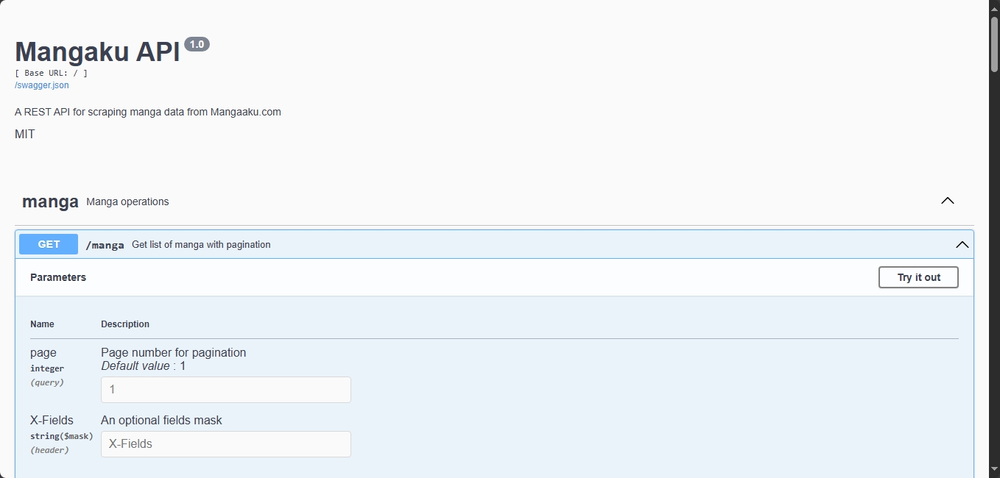
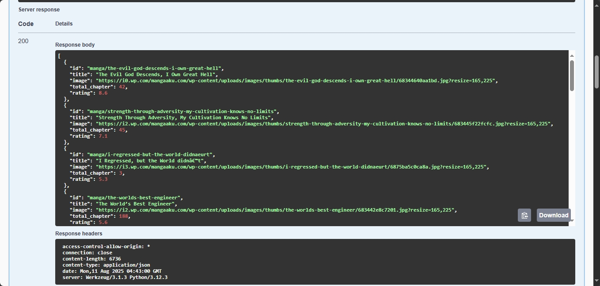

<div align="center">

# 🎌 Mangaku API

### *The Ultimate Manga Scraping REST API*

[](https://www.python.org/downloads/)
[](https://flask.palletsprojects.com/)
[](LICENSE)
[](http://localhost:5000/docs/)
[](https://github.com/badruzbby/mangaku-api/stargazers)
[](https://github.com/badruzbby/mangaku-api/network/members)

*A powerful, fast, and reliable REST API for scraping manga data from Mangaaku.com with beautiful Swagger documentation*

[🚀 **Live Demo**](http://localhost:5000/docs/) • [📖 **Documentation**](#-api-documentation) • [🤝 **Contributing**](#-contributing) • [💬 **Discord**](#-support)

</div>

---

## 🌟 **Why Choose Mangaku API?**

<table>
<tr>
<td width="50%">

### 🚀 **Lightning Fast**
- Optimized scraping algorithms
- Multiple server fallbacks
- Efficient data caching
- Minimal response times

### 📚 **Comprehensive Data**
- Complete manga information
- Chapter lists and images
- Ratings, genres, and metadata
- Multi-server image sources

</td>
<td width="50%">

### 🔧 **Developer Friendly**
- Interactive Swagger UI
- RESTful API design
- JSON responses
- CORS enabled

### 🛡️ **Production Ready**
- Error handling
- Input validation
- Rate limiting ready
- Schema validation

</td>
</tr>
</table>

---

## 📸 **Screenshots**

<div align="center">

### Swagger Documentation Interface
*Beautiful, interactive API documentation*



### API Response Example
*Clean, structured JSON responses*



</div>

---

## ✨ **Features**

<div align="center">

| Feature | Description | Status |
|---------|-------------|--------|
| 📖 **Manga List** | Paginated manga discovery | ✅ |
| 🔍 **Manga Details** | Complete manga information | ✅ |
| 📑 **Chapter Reading** | Multi-server image sources | ✅ |
| 📊 **Swagger Docs** | Interactive API documentation | ✅ |
| 🌐 **CORS Support** | Cross-origin requests | ✅ |
| ✅ **Schema Validation** | Marshmallow data validation | ✅ |
| ⚡ **Rate Limiting** | API protection (coming soon) | 🔄 |
| 🔐 **Authentication** | API key support (planned) | 📋 |

</div>

---

## 🚀 **Quick Start**

### **One-Click Setup**

```bash
# Clone the repository
git clone https://github.com/badruzbby/mangaku-api.git
cd mangaku-api

# Create virtual environment
python -m venv env
source env/bin/activate  # Windows: env\Scripts\activate

# Install dependencies
pip install -r requirements.txt

# Run the API
python app.py
```

### **Docker Setup** 🐳

```bash
# Build and run with Docker
docker build -t mangaku-api .
docker run -p 5000:5000 mangaku-api
```

### **Access the API**

🌐 **API Base URL:** `http://localhost:5000`  
📚 **Swagger Documentation:** `http://localhost:5000/docs/`

---

## 🛠️ **API Endpoints**

<details>
<summary><b>📖 GET /manga - Get Manga List</b></summary>

### Request
```bash
curl -X GET "http://localhost:5000/manga?page=1"
```

### Response
```json
[
  {
    "id": "one-piece",
    "title": "One Piece",
    "image": "https://example.com/one-piece.jpg",
    "total_chapter": 1000,
    "rating": 9.5
  }
]
```
</details>

<details>
<summary><b>🔍 GET /manga/{id} - Get Manga Details</b></summary>

### Request
```bash
curl -X GET "http://localhost:5000/manga/one-piece"
```

### Response
```json
{
  "id": "one-piece",
  "title": "One Piece",
  "description": "Epic pirate adventure...",
  "synopsis": "Monkey D. Luffy explores the Grand Line...",
  "genre": ["Action", "Adventure", "Comedy"],
  "author": "Eiichiro Oda",
  "status": "Ongoing",
  "year": 1997,
  "rating": "9.5",
  "views": 1000000,
  "chapter": 1000,
  "chapter_list": ["/chapter-1", "/chapter-2"]
}
```
</details>

<details>
<summary><b>📑 GET /read/{chapter} - Get Chapter Images</b></summary>

### Request
```bash
curl -X GET "http://localhost:5000/read/manga/one-piece/chapter-1"
```

### Response
```json
{
  "title": "One Piece Chapter 1",
  "chapter": {
    "Server 1": ["image1.jpg", "image2.jpg"],
    "Server 2": ["backup1.jpg", "backup2.jpg"],
    "Server 3": ["mirror1.jpg", "mirror2.jpg"]
  }
}
```
</details>

---

## 📊 **Response Models**

### 📖 **Manga Model**
```typescript
interface Manga {
  id: string;           // Unique identifier
  title: string;        // Manga title
  image: string;        // Cover image URL
  total_chapter: number; // Chapter count
  rating: number;       // User rating
}
```

### 🔍 **Manga Detail Model**
```typescript
interface MangaDetail {
  id: string;
  title: string;
  image: string;
  description: string;   // Short description
  synopsis: string;      // Full synopsis
  type: string;         // Manga, Manhwa, etc.
  status: string;       // Ongoing, Completed
  year: number;         // Publication year
  genre: string[];      // Genre tags
  chapter: number;      // Total chapters
  chapter_list: string[]; // Chapter URLs
  author: string;       // Author name
  rating: string;       // Rating score
  views: number;        // View count
}
```

---

## 🏗️ **Project Structure**

```
mangaku-api/
├── 📄 app.py                 # Flask application & API routes
├── 📄 requirements.txt       # Python dependencies
├── 📄 README.md             # Project documentation
├── 📄 Dockerfile            # Docker configuration
├── 📄 .gitignore            # Git ignore rules
└── 📁 scraper/
    ├── 📄 __init__.py
    ├── 📄 mangaku.py        # Main scraper class
    ├── 📁 schema/
    │   └── 📄 komik_schema.py  # Marshmallow schemas
    └── 📁 utils/
        ├── 📄 request_attr.py  # Request headers
        └── 📄 parsing_comic.py # Comic parsing utilities
```

---

## 🤝 **Contributing**

We ❤️ contributions! Here's how you can help make Mangaku API even better:

### **🌟 Ways to Contribute**

- 🐛 **Report bugs** - Found an issue? Let us know!
- 💡 **Suggest features** - Have ideas? We'd love to hear them!
- 📝 **Improve docs** - Help others understand the project
- 🔧 **Submit PRs** - Fix bugs or add new features
- ⭐ **Star the repo** - Show your support!

### **🔧 Development Setup**

1. **Fork the repository**
2. **Create a feature branch**
   ```bash
   git checkout -b feature/amazing-feature
   ```
3. **Make your changes**
4. **Add tests** (if applicable)
5. **Commit your changes**
   ```bash
   git commit -m "Add amazing feature"
   ```
6. **Push to your branch**
   ```bash
   git push origin feature/amazing-feature
   ```
7. **Open a Pull Request**

### **📋 Contribution Guidelines**

- Follow PEP 8 style guidelines
- Add docstrings to new functions
- Update tests for new features
- Keep commits atomic and well-described
- Be respectful in discussions

---

## 📈 **Roadmap**

### **🔄 Current Sprint**
- [ ] Add rate limiting
- [ ] Implement caching layer
- [ ] Add search functionality
- [ ] Performance optimizations

### **📋 Planned Features**
- [ ] Authentication system
- [ ] Favorite manga tracking
- [ ] Reading progress API
- [ ] Recommendation engine
- [ ] Mobile app support
- [ ] GraphQL endpoint

### **🎯 Long-term Goals**
- [ ] Multiple manga sources
- [ ] Real-time notifications
- [ ] Community features
- [ ] Advanced analytics
- [ ] Machine learning integration

---

## 📊 **Stats & Metrics**

<div align="center">


### **Project Metrics**
[](https://github.com/badruzbby/mangaku-api/issues)
[](https://github.com/badruzbby/mangaku-api/pulls)
[](https://github.com/badruzbby/mangaku-api/graphs/contributors)
[](https://github.com/badruzbby/mangaku-api/commits/main)

</div>

---

## 🛡️ **Security & Best Practices**

### **🔒 Security Features**
- Input validation and sanitization
- CORS protection
- Error handling without data leakage
- Secure HTTP headers

### **⚡ Performance**
- Efficient scraping algorithms
- Minimal memory footprint
- Fast JSON serialization
- Optimized database queries

---

## 💬 **Support & Community**

<div align="center">

### **Get Help & Connect**

[](https://discord.gg/yourdiscord)
[](https://t.me/yourchannel)
[](mailto:badzzhaxor@gmail.com)

</div>

### **📞 Support Channels**

- 🐛 **Bug Reports:** [GitHub Issues](https://github.com/badruzbby/mangaku-api/issues)
- 💡 **Feature Requests:** [GitHub Discussions](https://github.com/badruzbby/mangaku-api/discussions)
- 📧 **Email:** badzzhaxor@gmail.com
- 💬 **Discord:** Join our community server

---

## 📜 **License & Legal**

### **📄 License**
This project is licensed under the **MIT License** - see the [LICENSE](LICENSE) file for details.

### **⚖️ Disclaimer**
This project is for **educational purposes only**. Please respect the terms of service of the target website and use responsibly. The developers are not responsible for any misuse of this software.

### **🤝 Code of Conduct**
We are committed to providing a welcoming and inspiring community for all. Please read our [Code of Conduct](CODE_OF_CONDUCT.md).

---

## 🙏 **Acknowledgments**

Special thanks to all contributors and the open-source community:

- 🎨 **UI/UX Inspiration:** Modern API documentation designs
- 🛠️ **Technical Stack:** Flask, BeautifulSoup, Marshmallow communities
- 📚 **Documentation:** Swagger/OpenAPI specification
- 🌟 **Contributors:** Everyone who has contributed to this project

---

<div align="center">

### **⭐ Star History**

[](https://star-history.com/#badruzbby/mangaku-api&Date)

### **🚀 Ready to Get Started?**

<a href="#-quick-start">
  
</a>
<a href="http://localhost:5000/docs/">
  
</a>
<a href="https://github.com/badruzbby/mangaku-api/fork">
  
</a>

---

**Made with ❤️ by [Muhammad Badruz Zaman](https://github.com/badruzbby)**

*If you find this project helpful, please consider giving it a ⭐!*

</div> 